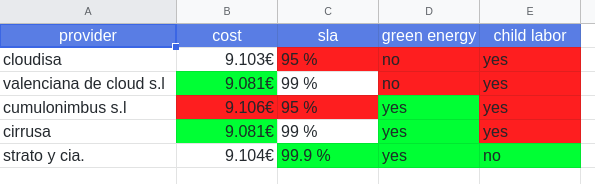
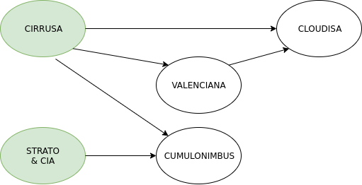

## Respuestas by Plou

* [a](#a)
* [b](#b)
* [c](#c)

## a

*¿Qué opción escogerías? ¿Por qué?*

Strato & CIA: Más mejoras que Cirrusa.

## b

*¿La opción que has escogido está en la frontera de pareto?*

Sí, junto a Cirrusa.

## c

*¿La opción que has escogido pareto-domina a nuestro provider actual, cloudisa?*

No, porque mejora todo excepto el coste (aunque sea mínimamente)
